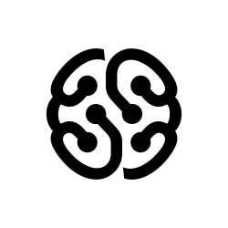

# Задачи Python 
---

```
git clone https://github.com/externalcharm/pythonEducation.git
```

---
## [Семинар 1:](https://github.com/externalcharm/pythonEducation/tree/main/seminar1)
    1. Напишите программу, которая принимает на вход цифру, обозначающую день недели, и проверяет, является ли этот день выходным.
    2. Напишите программу для. проверки истинности утверждения ¬(X ⋁ Y ⋁ Z) = ¬X ⋀ ¬Y ⋀ ¬Z для всех значений предикат.
    3. Напишите программу, которая принимает на вход координаты точки (X и Y), причём X ≠ 0 и Y ≠ 0 и выдаёт номер четверти плоскости,  в которой находится эта точка (или на какой оси она находится).
    4. Напишите программу, которая по заданному номеру четверти, показывает диапазон возможных координат точек в этой четверти (x и y).
    5. Напишите программу, которая принимает на вход координаты двух точек и находит расстояние между ними в 2D пространстве.
---

## [Семинар 2:](https://github.com/externalcharm/pythonEducation/tree/main/seminar2)
    1. Напишите программу, которая принимает на вход вещественное число и показывает сумму его цифр. 
    2. Напишите программу, которая принимает на вход число N и выдает набор произведений чисел от 1 до N.
    3. Задайте список из n чисел последовательности (1+1n)n и выведите на экран их сумму.
    4. Задайте список из N элементов, заполненных числами из промежутка [-N, N]. Найдите произведение элементов на указанных позициях. Позиции хранятся в файле file.txt в одной строке одно число.
    5. Реализуйте алгоритм перемешивания списка.
---

## [Семинар 3:](https://github.com/externalcharm/pythonEducation/tree/main/seminar3)
    1. Задайте список из нескольких чисел. Напишите программу, которая найдёт сумму элементов списка, стоящих на нечётной позиции.
    2. Напишите программу, которая найдёт произведение пар чисел списка. Парой считаем первый и последний элемент, второй и предпоследний и т.д.
    3. Задайте список из вещественных чисел. Напишите программу, которая найдёт разницу между максимальным и минимальным значением дробной части элементов.
    4. Напишите программу, которая будет преобразовывать десятичное число в двоичное.
    5. Задайте число. Составьте список чисел Фибоначчи, в том числе для отрицательных индексов.
---

## [Семинар 4:](https://github.com/externalcharm/pythonEducation/tree/main/seminar4) 
    1. Вычислить число c заданной точностью d
    2. Задайте натуральное число N. Напишите программу, которая составит список простых множителей числа N.
    3. Задайте последовательность чисел. Напишите программу, которая выведет список неповторяющихся элементов исходной последовательности.
    4. Задана натуральная степень k. Сформировать случайным образом список коэффициентов (значения от 0 до 100) многочлена и записать в файл многочлен степени k. 
    5. Даны два файла, в каждом из которых находится запись многочлена. Задача: сформировать файл, содержащий сумму многочленов.
---

## [Семинар 5:](https://github.com/externalcharm/pythonEducation/tree/main/seminar5)
    1. Напишите программу, удаляющую из текста все слова, содержащие ""абв"".
    2. Создайте программу для игры с конфетами человек против человека.
    3. Создайте программу для игры в ""Крестики-нолики"".
    4. Реализуйте RLE алгоритм: реализуйте модуль сжатия и восстановления данных.
---

## [Семинар 6:](https://github.com/externalcharm/pythonEducation/tree/main/seminar6)
### рефактор задач с использованием list comprehension, lambda, filter, map, join, zip, enumerate
    1. Задайте список из нескольких чисел. Напишите программу, которая найдёт сумму элементов списка, стоящих на нечётной позиции.
    2. Напишите программу, которая принимает на вход координаты двух точек и находит расстояние между ними в 2D пространстве.
    3. Напишите программу, которая найдёт произведение пар чисел списка. Парой считаем первый и последний элемент, второй и предпоследний и т.д.
    4. Напишите программу, которая определит позицию второго вхождения строки в списке либо сообщит, что её нет.
    5. Задайте список. Напишите программу, которая определит, присутствует ли в заданном списке строк некое число.
    6. Напишите программу, удаляющую из текста все слова, содержащие ""абв"".
---

## [Семинар 7:](https://github.com/externalcharm/pythonEducation/tree/main/seminar7)
### Задача:
>_Создать телефонный справочник с возможностью импорта и экспорта данных в нескольких форматах._
---

## [Семинар 8:](https://github.com/externalcharm/pythonEducation/tree/main/seminar8)
### Задача:
>_Создать информационную систему позволяющую работать с сотрудниками некой компании \ студентами вуза \ учениками школы_
---